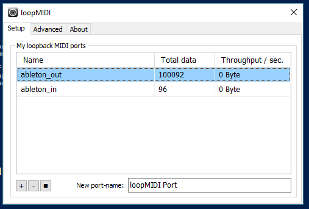

# midi-lan
node js application to transmit MIDI message on network with udp sockets

---
Hay 2 archivos iniciales de la applicación, el principal es "index-rt.js" este utiliza rtMidi (https://github.com/justinlatimer/node-midi) para leer y escribir los puertos MIDI, el segundo "index-jazz.js" utiliza jazz-midi (https://www.npmjs.com/package/jazz-midi) para el mismo fin, ya que rtMidi requiere compilar el codigo C++ con node-gyp en algunos casos no compila (como en mi caso, al principio), por eso el plan B es jazz-midi.

##Dependencias
-Node Js

-Node-gyp (recomendado)

## Instalación
Descarga las fuentes, puede ser en zip, o con git:

    git clone https://github.com/luisgilg/midi-lan.git

Ejecuta la instalación con npm

    cd midi-lan
    npm install
Si se tiene problemas con node-gyp se puede forzar la instalación y ejecutar la aplicación con el archivo "index-jazz.js"

Para ejecutar la aplicación(una sola de las 2):

    node index-rt.js
    node index-jazz.js

## Configuración

Sugiero utilizar IP estática en ambas computadoras, por ejemplo la Terminal A: 192.168.0.3 y la Terminal B: 192.168.0.4, el puerto por defecto es el 14123. Puede ser que en algunos casos se tenga que configurar manualmente el firewall para permitir conexiones por ese puerto.

100% recomendado utilizar cable de red, NO ir por WIFI, ya que las conexiones UDP son rápidas porque no se hace comprobación de paquete (ACK) esa misma ventaja juega en contra en cuando se va por WIFI ya que si hay pérdida de datos no se recuperan nunca más. Lo peor que puede pasar es que no llegue nunca el mensaje MIDI que dice la una tecla se levantó y la misma quede sonando hasta la eternidad.

Descarga loopMidi (http://www.tobias-erichsen.de/software/loopmidi.html) y crea 2 puertos en cada computadora, uno será utilizado para leer los mensajes que emite el DAW y pasarlo por red a la otra terminal, el segundo sera para mandar de vuelta al DAW los mensajes midis recibidos por la red. ej:

En el DAW tienes que activar los puertos:

En el DAW se selecciona los puertos, un puerto de entrada y otro de salida.

Abrir el archivo a utilizar, dependiendo del caso, index-jazz.js / index-rt.js, en la primeras líneas configurar los puertos a utilizar y el Ip de la terminal a conectarse.

    const defaultInMidiPort = 1; 
    const defaultOutMidiPort = 3;
    
    const address = '192.168.0.4';
    const defaulUTPPort = 14123;

Para conocer el número del puerto, solo ejecuta la aplicación y leer lo que te arroja en consola:

    C:\midi-lan-git\midi-lan>node index-rt.js
    MIDI Input devices found:
    
    LoopBe Internal MIDI 0 --puerto de lectura 0
    ableton_out 1 --puerto de lectura 1
    ableton_in 2 --puerto de lectura 2
    Bome's Midi Translator 1 3 --puerto de lectura 3
    
    MIDI Output devices found:
    
    Microsoft GS Wavetable Synth 0 --puerto de escritura 0
    LoopBe Internal MIDI 1 --puerto de escritura 1
    ableton_out 2 --puerto de escritura 2
    ableton_in 3 --puerto de escritura 3
    2- Bome's Midi Translator 1 4 --puerto de escritura 4
    
    Default MIDI-In port: ableton_out 1
    Default MIDI-Out port: ableton_in 3
    socket listening 192.168.0.4:14123
